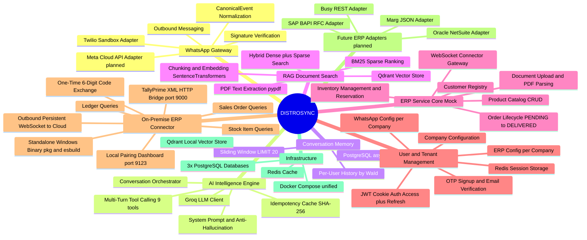

# Feature mindmap

```mermaid
mindmap
  root((DISTROSYNC))
    WhatsApp Gateway
      Twilio Sandbox Adapter
      Meta Cloud API Adapter planned
      CanonicalEvent Normalization
      Signature Verification
      Outbound Messaging
    AI Intelligence Engine
      Groq LLM Client
      Conversation Orchestrator
      System Prompt and Anti-Hallucination
      Multi-Turn Tool Calling 9 tools
      Idempotency Cache SHA-256
    Conversation Memory
      PostgreSQL asyncpg
      Per-User History by WaId
      Sliding Window LIMIT 20
    RAG Document Search
      PDF Text Extraction pypdf
      Chunking and Embedding SentenceTransformers
      Qdrant Vector Store
      BM25 Sparse Ranking
      Hybrid Dense plus Sparse Search
    ERP Service Core Mock
      Product Catalog CRUD
      Inventory Management and Reservation
      Customer Registry
      Order Lifecycle PENDING to DELIVERED
      Document Upload and PDF Parsing
      WebSocket Connector Gateway
    User and Tenant Management
      OTP Signup and Email Verification
      JWT Cookie Auth Access plus Refresh
      Redis Session Storage
      Company Configuration
      WhatsApp Config per Company
      ERP Config per Company
    On-Premise ERP Connector
      TallyPrime XML HTTP Bridge port 9000
      Outbound Persistent WebSocket to Cloud
      Local Pairing Dashboard port 9123
      One-Time 6-Digit Code Exchange
      Stock Item Queries
      Ledger Queries
      Sales Order Queries
      Standalone Windows Binary pkg and esbuild
    Future ERP Adapters planned
      SAP BAPI RFC Adapter
      Busy REST Adapter
      Marg JSON Adapter
      Oracle NetSuite Adapter
    Infrastructure
      Docker Compose unified
      3x PostgreSQL Databases
      Redis Cache
      Qdrant Local Vector Store
```
